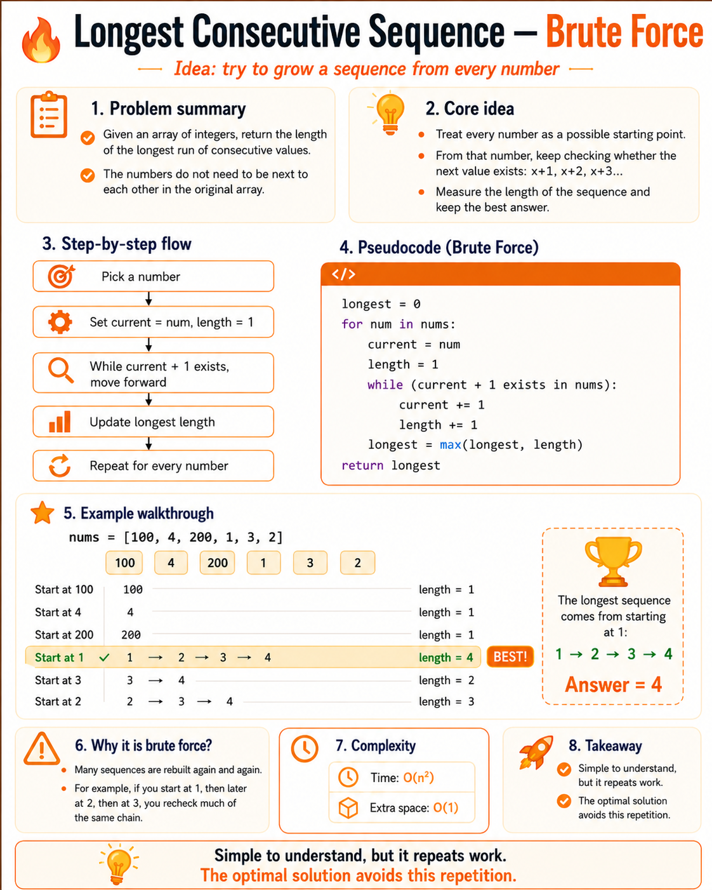
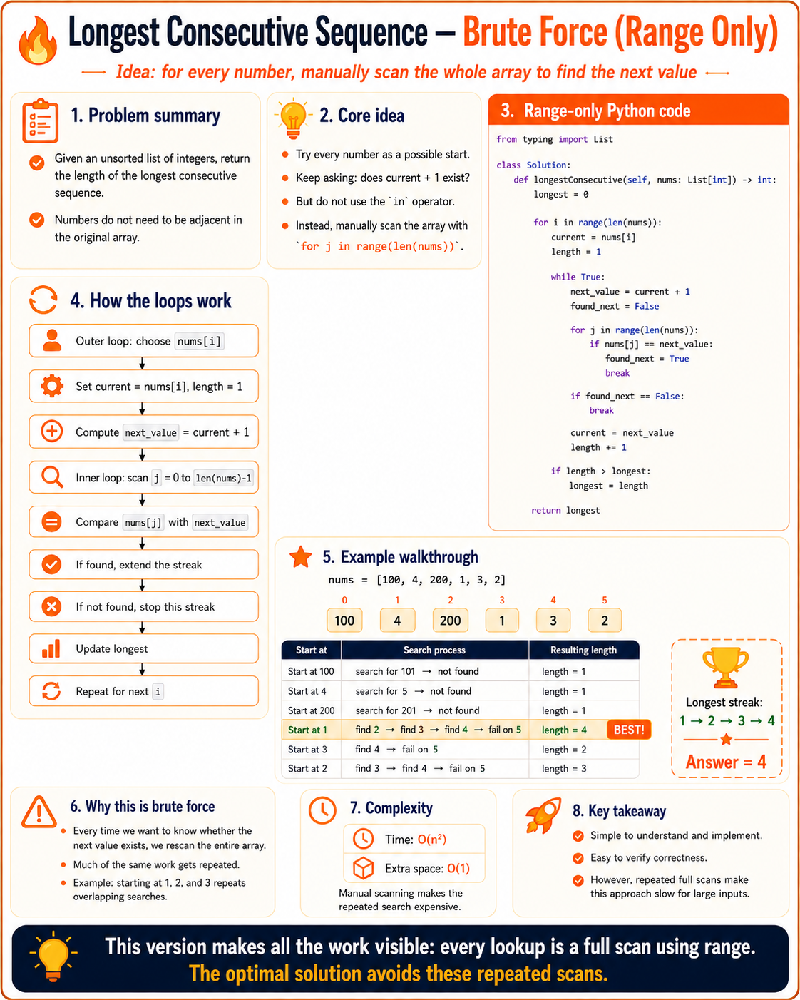
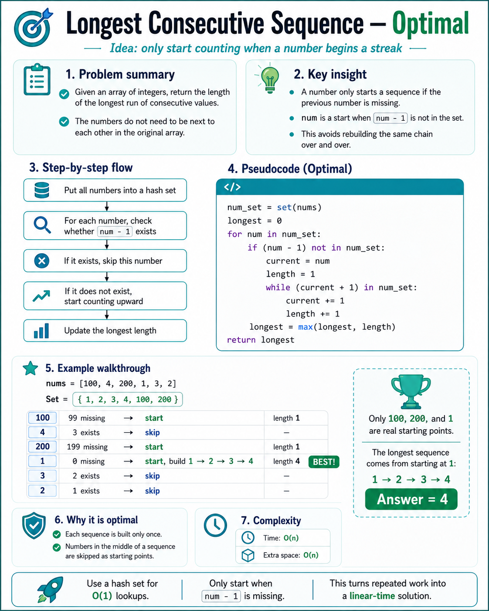

# Longest Consecutive Sequence

Current accepted submission: [submission-0.py](submission-0.py)

This submission is the range-only brute force version. It tries each number as a possible start, then repeatedly scans the whole input with `range(len(nums))` to find the next value in the streak.

## Brute Force Approach

The brute force idea is simple:

- pick each number as a possible starting point
- look for `current + 1`
- extend the streak while the next value can be found
- keep the longest streak length seen

The submitted range-only version makes each lookup explicit by manually scanning the array instead of using `in`.

## Optimal Approach Preview

The optimal version uses a hash set for constant-time lookups and only starts counting when `num - 1` is missing. That means each sequence is built once instead of being rebuilt from every number in the middle of the streak.

## Infographics

