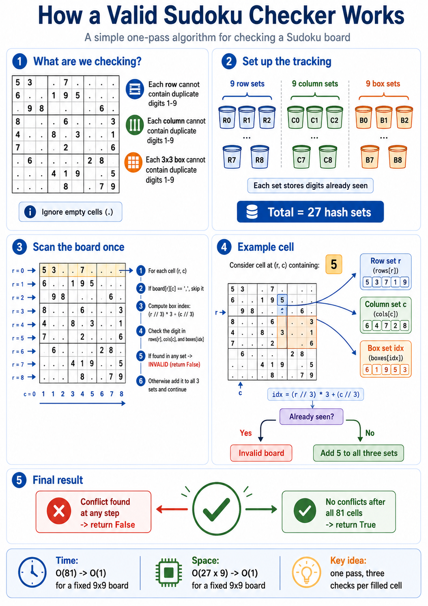
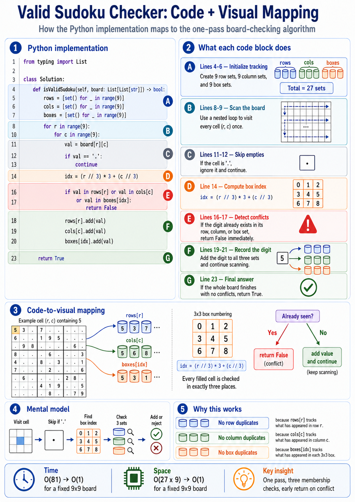
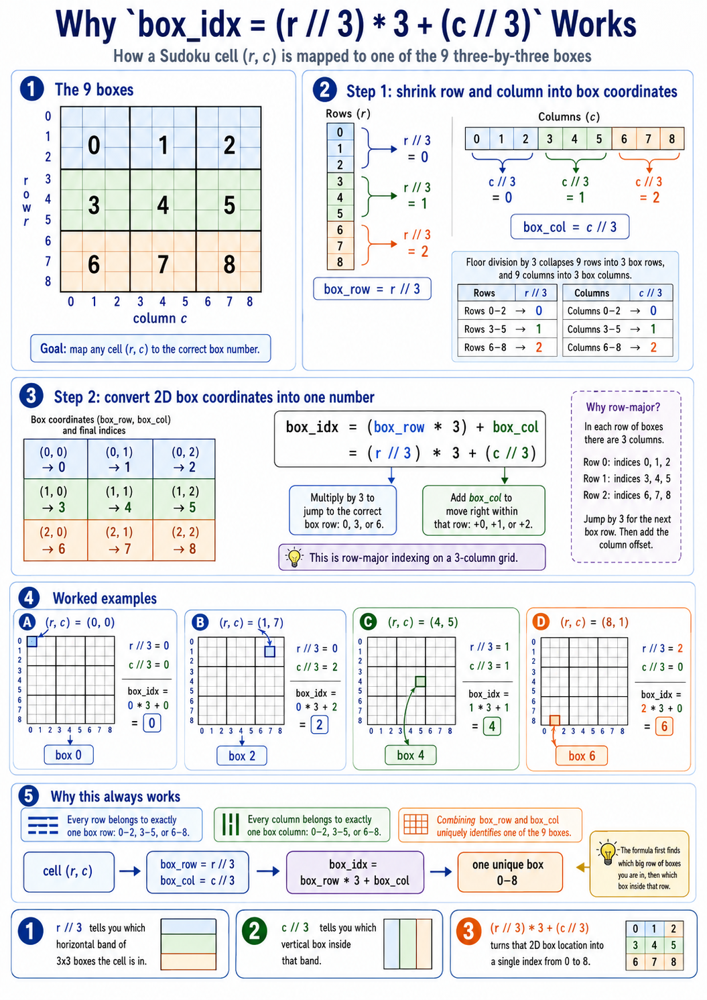

# Valid Sudoku

Accepted solution: [submission-8.py](submission-8.py)

The solution scans the board once and tracks digits already seen in three places:

- one set for each row
- one set for each column
- one set for each 3x3 box

The box index calculation is:

```python
box_idx = (r // 3) * 3 + (c // 3)
```

For each filled cell, the value must be absent from its row set, column set, and box set. If the value already exists in any of those sets, the board is invalid. Otherwise, the value is recorded in all three sets and scanning continues.

## Infographics






